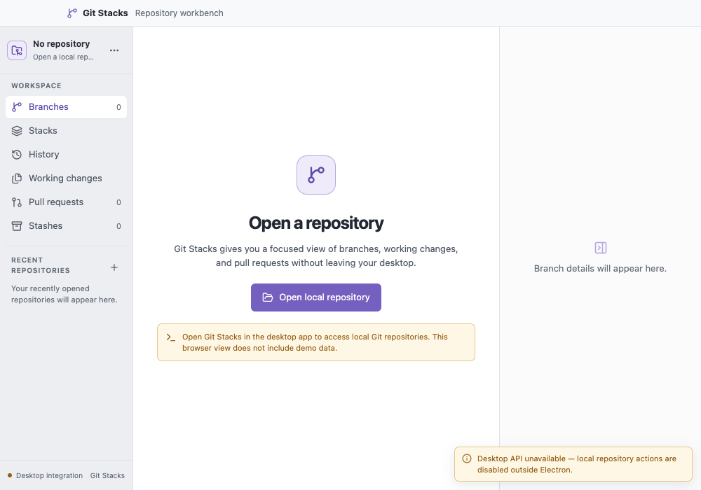
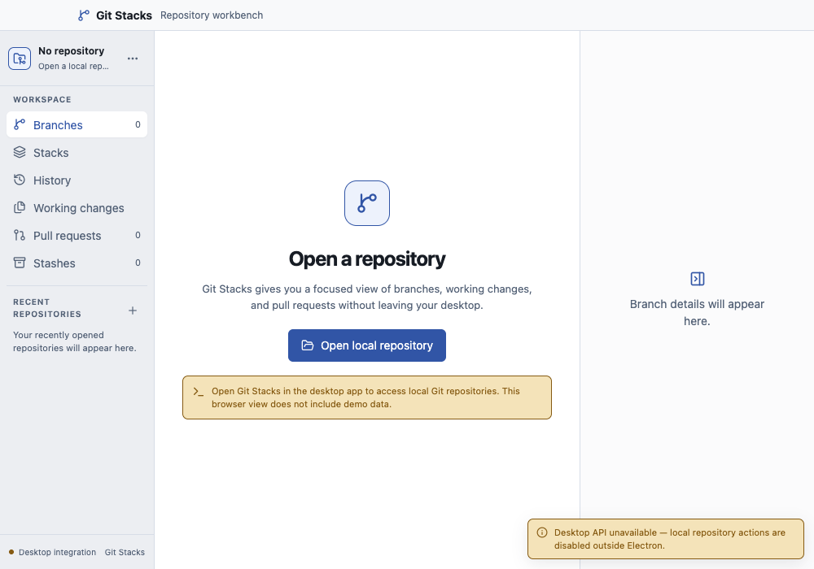
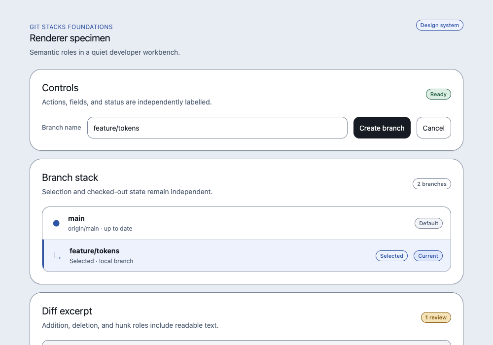
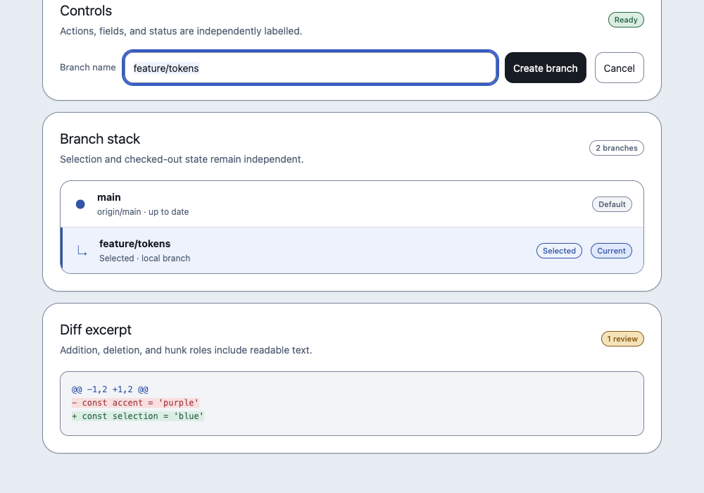

# Design-system implementation architecture (issue #3 foundations)

`README.md` is the semantic and visual source of truth for the Git Stacks
foundations: palette roles, type scale, spacing, radii, density, motion, state
rules, contrast evidence, and the legacy migration map. This file is
implementation architecture guidance only and does not restate the token
palette.

## shadcn/ui baseline

This foundation builds on the repository's existing
[shadcn/ui](https://ui.shadcn.com/) setup without redesigning it.

- `components.json` is set to the shadcn/ui New York style with CSS variables
  enabled and the configured `components`, `ui`, `utils`, `lib`, and `hooks`
  path aliases.
- The existing button (`src/renderer/src/components/ui/button.tsx`) is
  CVA-based (`class-variance-authority`) and composes variants through the
  shared `cn()` helper in `src/renderer/src/lib/utils.ts`
  (`clsx` + `tailwind-merge`).
- The stack is Tailwind CSS v4 with Radix primitives (`radix-ui`) and Lucide
  icons (`lucide-react`); see `badge.tsx`, `dialog.tsx`, `hover-card.tsx`,
  `input.tsx`, and `tooltip.tsx` for the configured primitives/CVA/cn/Radix
  pattern.
- The generated token CSS exposes semantic Tailwind `@theme` aliases, so
  components consume semantic/component variables or the equivalent Tailwind
  utilities without importing a second palette.
- shadcn/ui is copied source and configuration, not a required runtime
  dependency. This slice adds no shadcn CLI application dependency and does
  not redesign this architecture.

## Token pipeline

- `src/renderer/src/design-system/tokens.json` is the canonical editable
  source with primitive, semantic, component, and temporary legacy layers.
- `src/renderer/src/design-system/generate-tokens.mjs` resolves every
  reference, fails on missing references or cycles, and writes deterministic
  `src/renderer/src/design-system/tokens.css`.
- Regenerate and validate with `npm run tokens:generate` and
  `npm run tokens:check`; `tokens.css` is generated output imported by
  `src/renderer/src/styles.css` and must not be edited by hand.
- New shared controls and newly migrated consumers use semantic/component
  variables or the equivalent Tailwind aliases; avoid new raw palette literals.
  Legacy `--*` aliases and remaining literal colors on unmigrated shell/domain
  rules (for example scrollbar/thumb and panes in `styles.css`) remain documented
  migration work in `README.md` and issues #4–#8.

## Renderer integration

- `src/renderer/src/main.tsx` imports the global stylesheet and exposes the
  opt-in real-renderer specimen at `#/design-system-specimen`
  (`FoundationsSpecimen.tsx`) without altering the normal six-view
  navigation.
- The specimen demonstrates a primary action, field, badges, selected row, and
  diff excerpt with keyboard-focusable controls and reduced-motion token
  support, and renders without desktop IPC or network access.

## Safety constraints

- Local-first Electron boundary is unchanged: sandboxed renderer
  (`sandbox: true`, `contextIsolation: true`, `nodeIntegration: false`), the
  typed `contextBridge` preload API in `src/preload/index.ts`, the explicit
  `ipcMain.handle` surface in `src/main/index.ts`, and the production
  Content-Security-Policy headers remain intact.
- No external font loading, no new production network dependency, and no
  change to Git semantics, preview/confirmation/busy locks, typed
  confirmations, or navigation behavior in this slice.

## Evidence

Static browser-served production renderer views at 1000x700. Main-app captures
visibly warn that the desktop API is unavailable. They are not packaged
Electron verification and make no 200%-zoom claim.

- `evidence/foundations-before-1000x700.png`: baseline main-app renderer view
  served in a browser at 1000x700 before foundations repair, with the desktop
  API unavailable warning visible.
- `evidence/foundations-after-1000x700.png`: repaired foundations main-app
  renderer view served in a browser at 1000x700, with the desktop API
  unavailable warning visible.
- `evidence/specimen-after-repair-1000x700.png`: repaired real-renderer
  specimen (`#/design-system-specimen`) at 1000x700 showing controls, branch
  stack, and the top of the diff excerpt.
- `evidence/specimen-focus-diff-1000x700.png`: repaired specimen at 1000x700
  with keyboard focus visible on the branch-name field and the scrolled diff
  excerpt showing hunk, addition, and deletion roles with readable text.

